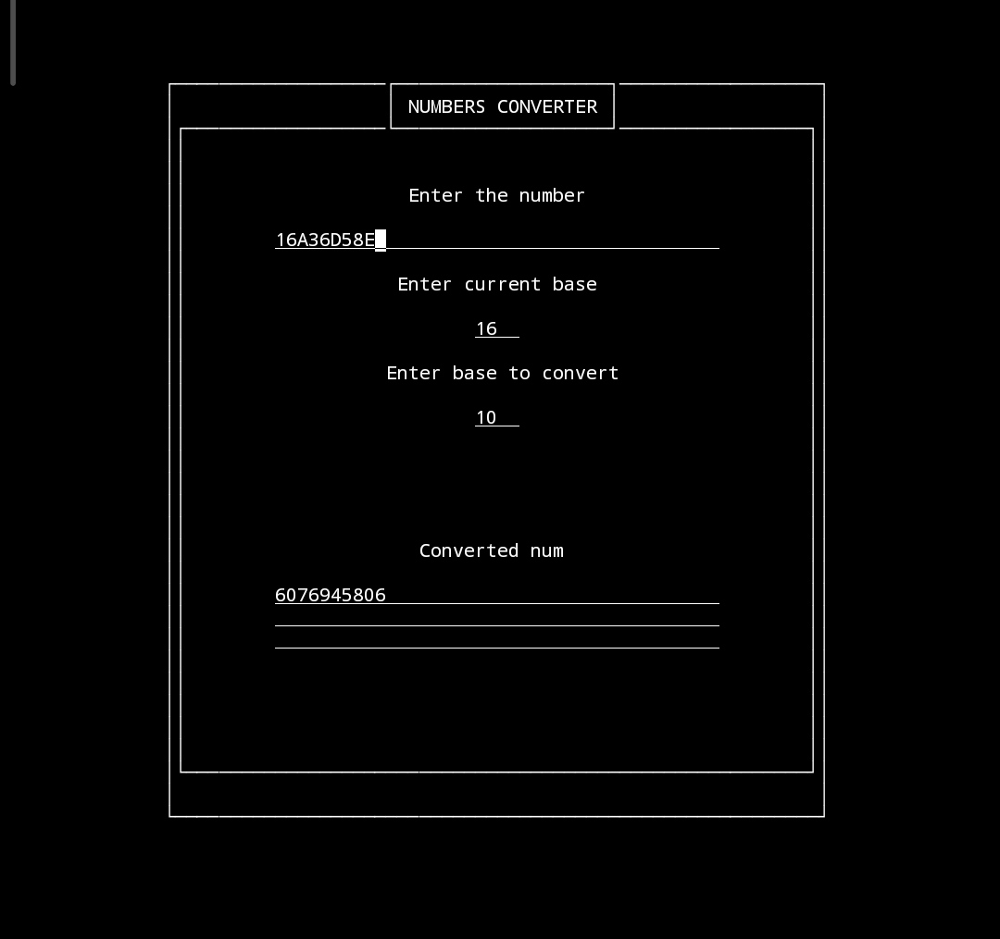
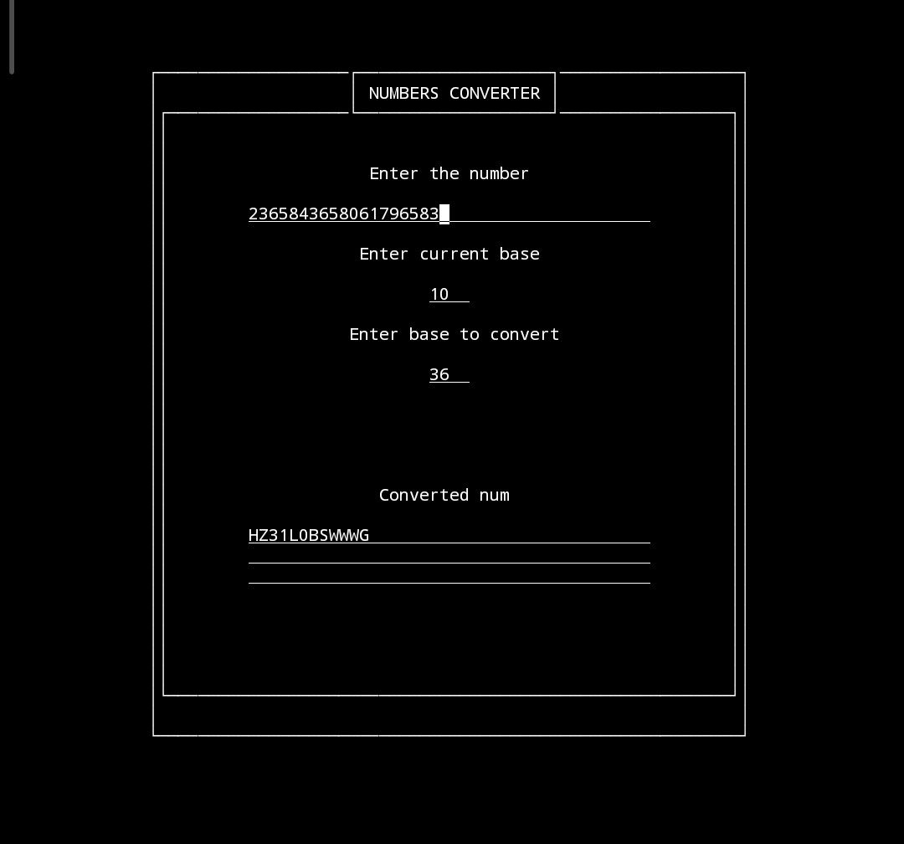

<h1 align='center'>
  

  NumbersConverter
</h1>
<h2>Description</h2>
This is my first program using ncurses library with forms, which converts numbers between numeral systems🔄. If you have anything to criticize about this project(bad code, bad infrastructure or anything else) please let me know🔉.
<h2>Preview</h2>
<h4 align='center'>
  
  
</h4>
<h2>How To Build</h2>
<h4>Follow this instructions:</h4>

 - ⬇️ Clone this repository with `git clone https://github.com/zzupart/NumbersConverter`

 - ⏺️ Create a build/ directory in it with `mkdir build/`

 - ➡️ Go to this directory with `cd build/`

 - ▶️ Run cmake in it with `cmake ../`

 - ▶️ Run make in it with `make`

 - ➡️ Go to the main directory with `cd ../`

 - ▶️ Run the executable with `./bin/NumbersConverter`
